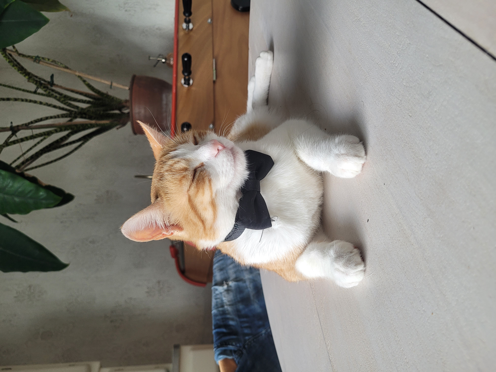
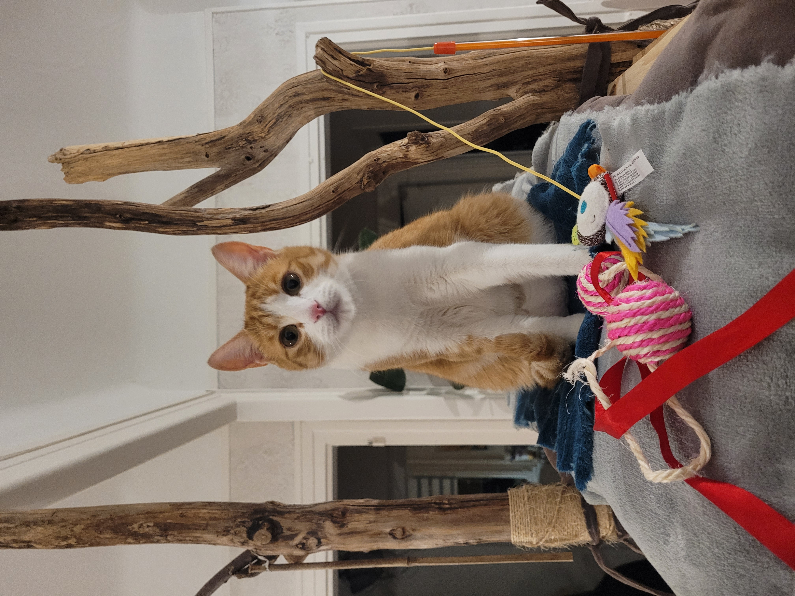

# Adoption Agency 
## Cats' section 
Let's present you our cats waiting for adoption!
- ### `Tigger` 
  
Here is a description of Tigger to see if his way of life fits yours!

| Genre | Compatibility with cats | Compatibility with dogs | Compatibility with children |
|-------|--------------------|---------------------|----------------------|
| Male  | OK               | No                 | OK                 |

>**Tigger**  is a two-year-old ginger and white cat, he is really affectionnate and loves to play outside. Tigger needs a companion to feel less alone, to keep him busy when you are not at home! Moreover, he is very kind, he loves to play which is very important to create a link between you and your future animal.  
>## Requirements:
> - to have a garden
> - to be home often
> - to have another cat

He lives with another cat, his sister who is also available for adoption, see her profile on this link.    
See below for further pictures of Tigger!

