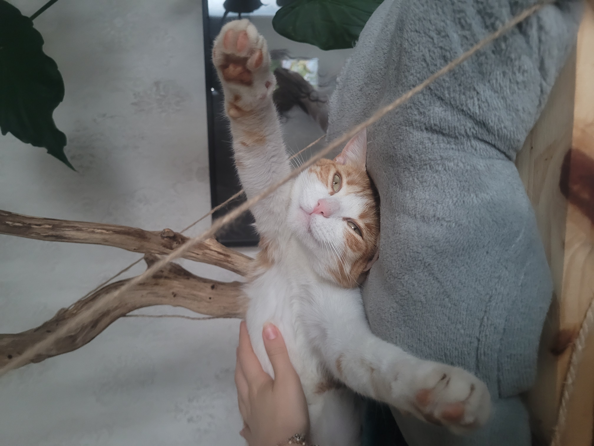

# Adoption Agency
## Cats' section  
Let's present you our cats waiting for adoption!
- ### `Tigger` 
  
Here is a description of Tigger to see if his way of life fits yours!

| Genre | Compatibility with cats | Compatibility with dogs | Compatibility with children |
|-------|--------------------|---------------------|----------------------|
| Male  | OK               | No                 | OK                 |

>**Tigger**  is a two-year-old ginger and white cat, he is really affectionnate and loves to play outside.
>
>Tigger might need a companion to feel less alone, to keep him busy when you are not at home often !  He needs a lot of attention from your part, this is why you must be home often to take care of him. 
>
>Moreover, he is very kind, he loves to play at home but also in the garden. You should have time dedicated to play with him, because it is very important to create a connection between you and your animal.  
>
>Tigger loves to sleep on people's laps and he will keep you company while you're sleeping. He talks a lot for a lots of reasons so don't be afraid if you hear him quite often. 
>
>
>> **Tigger** is sterilized, he is chipped, and up to date in his vaccins!

>## Requirements:
> - to have a garden
> - to be home often
> - (if possible) to have another cat

He lives with another cat, his sister who is also available for adoption, see her profile on this [link!](index_2.md)

>>

* * *  
~~~
~See below for further pictures of Tigger!~
~~~

  
  
   

For now, Tigger is in a foster home, if you are interrested in adoption, here are the foster home's [contacts!](phone_number_index.md)
 

### All he is waiting for is `you`!

  

