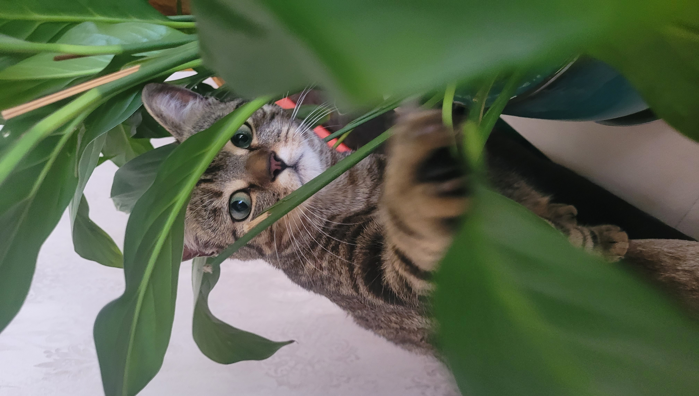
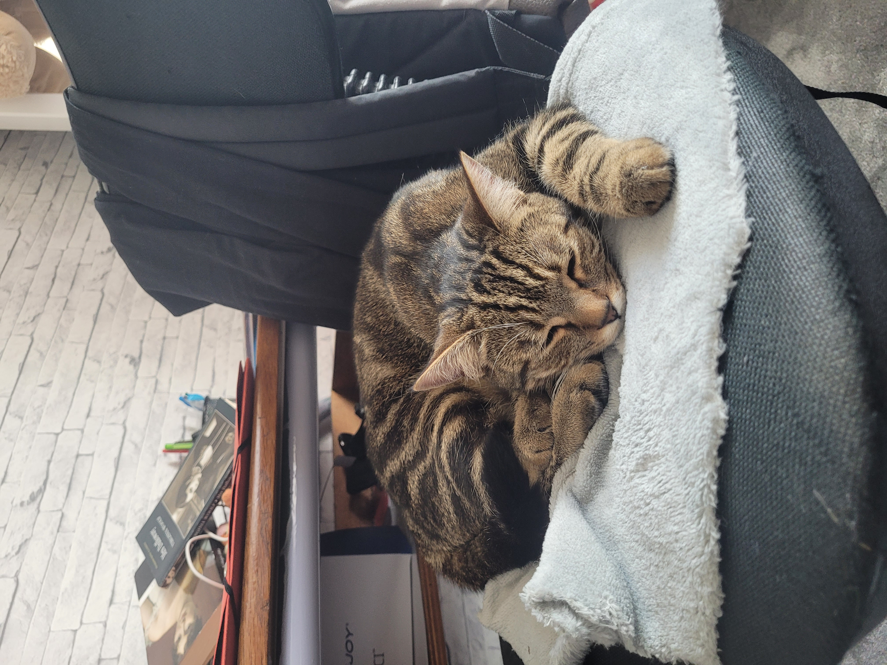

## Cats' section
Let's present you our cats waiting for adoption!
- ### `Sylvester`  
  
Here is a description of Silvester to see if her way of life fits yours!

| Genre | Compatibility with cats | Compatibility with dogs | Compatibility with children |
|-------|--------------------|---------------------|----------------------|
| Female  | No               | No                 | unknown                |

>>#### `Important`:
>
 Note that Silvester lives with a male cat Tigger, but she is not fond of sharing her territory with other cats. So, it will be better not to have another companion at home!
>>
>**Sylvester** is a two-year-old female, she has a splendid shade of colours as you can see! She loves to play with people but most of all she needs a garden because she goes outside a lot. She likes to hunt, so do not be afraid to find a present at home.
>
>She can be very sweet when she wants, but be careful when she is not in the mood, just give her space. She is not aggressive but she will let you know when she wants to be left alone! Sylvester has never been near children, therefore we can't predict her behavior around them.
>>
>> **Sylvester** is sterilized, she is chipped, and up to date in her vaccins.
>

>## Requirements:
> - to have a garden
> - not to have another animal
> - may not have children

Here is the [link](index_3.md) to see the profil of our last cats available for adoption! 
* * *  
~~~
See below for further pictures of Sylvester! 
~~~

  
  
   

For now, Sylvester is in a foster home, if you are interrested in adoption, here are the foster home's [contacts!](phone_number_index.md) 

