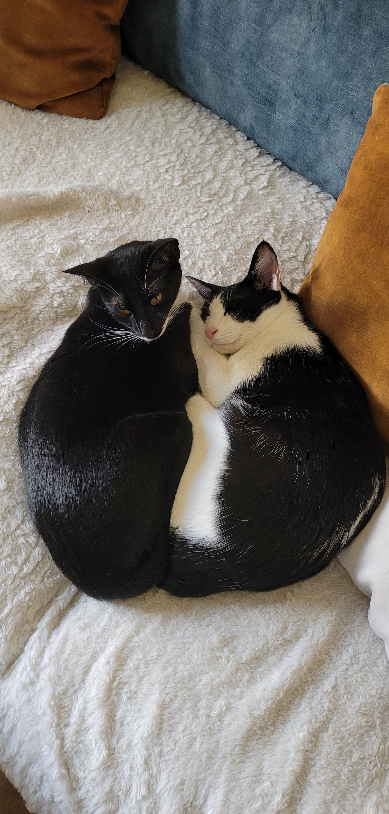
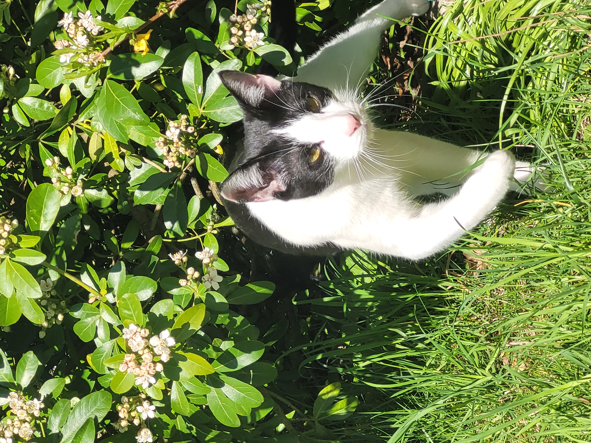

## Cats' section
Let's present you our cats waiting for adoption!
- ### ~~`Chupa and Chups`~~ they have been adopted already
  
Here is a description of Chupa and Chups to see if their ways of life fit yours!

| Genre | Compatibility with cats | Compatibility with dogs | Compatibility with children |
|-------|--------------------|---------------------|----------------------|
| Female and male  | OK               | Unknown                 | OK                |

>>#### `Important`:
>
 Chupa and Chups are brothers and sisters. They live together and must be adopted together as well!
 Chupa is a female cat, she is mostly black with white paws. And Chups is a male cat, he is black and white.

>**Chupa** is a four-year-old female, she is very beautiful as you can see! Chupa is close to humans, she loves to sit on people's laps for hours. She also likes going outside, a lot! She sometimes does not go home for days but she always comes back, don't worry! Chupa is a great huntress so don't be surprised to find a present in your home after a night out.
>
>She sometimes plays with her brother, however she will let him know when she does not want to play anymore. Chupas often comes home with wounds like skin conditions which are easilly to treat, don't worry!

>**Chups** is a four-year-old male, he is very handsome! Chups is also close to humans and loves to sleep on someone. He should have an access to a garden because he loves to stay outside and hunt. He will often bring you his prey at home so don't be surprised.
>
>He likes to play with cat toys at home so make sure to untertain him. Chups is a cat with a great ability to speak mostly when he wants to go out. Chups often comes back with minor wounds, we don't know if he is agreat fighter or just very clumsy.

>**Chupa and Chups** are used to eat dry cat food, they don't usually eat wet cat food. However be careful because they love to lick the saucepans after you've just cooked. Be careful not to let anything open in the kitchen!
>
>They have access to a litter at home to avoid little incidents and they'd rather go to the litter when it's too cold outside. 

>## Requirements:
> - to have a garden
> - to adopt both of them

>> Chupa and Chups are sterilized, they are chipped, and up to date in their vaccins.

* * *  
~~~
See below for further pictures of Chupas and Chups! 
~~~

  
  
   

  
  
   

